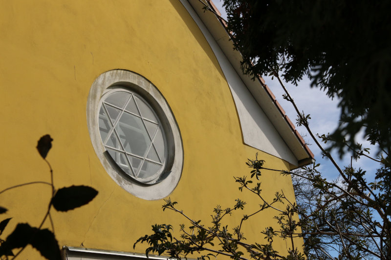

---
# Feel free to add content and custom Front Matter to this file.
# To modify the layout, see https://jekyllrb.com/docs/themes/#overriding-theme-defaults

layout: home
title: Synagoga v Kamenici nad Lipou
lang: cs
---
Zachraňme společně bývalou synagogu a evangelickou modlitebnu jako místo paměti!

Synagoga v Kamenici nad Lipou, do nedávna využívaná jako kostel Českobratrské církve evangelické, je v současnosti jediným místem připomínajícím dějiny Židů a holokaustu přímo ve městě. Spolek si klade za cíl uchovat tento unikátní prostor a pomoci jej proměnit v místo připomínky, vzdělávání a setkávání zachovávající multikulturní historie Kamenice a širšího regionu.

Českobratrská církev bývalou synagogu pomohla po druhé světové válce zachovat jako církevní prostor a s ním i památku kamenické židovské obce zničené v době holokaustu. Nyní je však budova ohrožena možným prodejem a přestavbou na rodinný dům.

